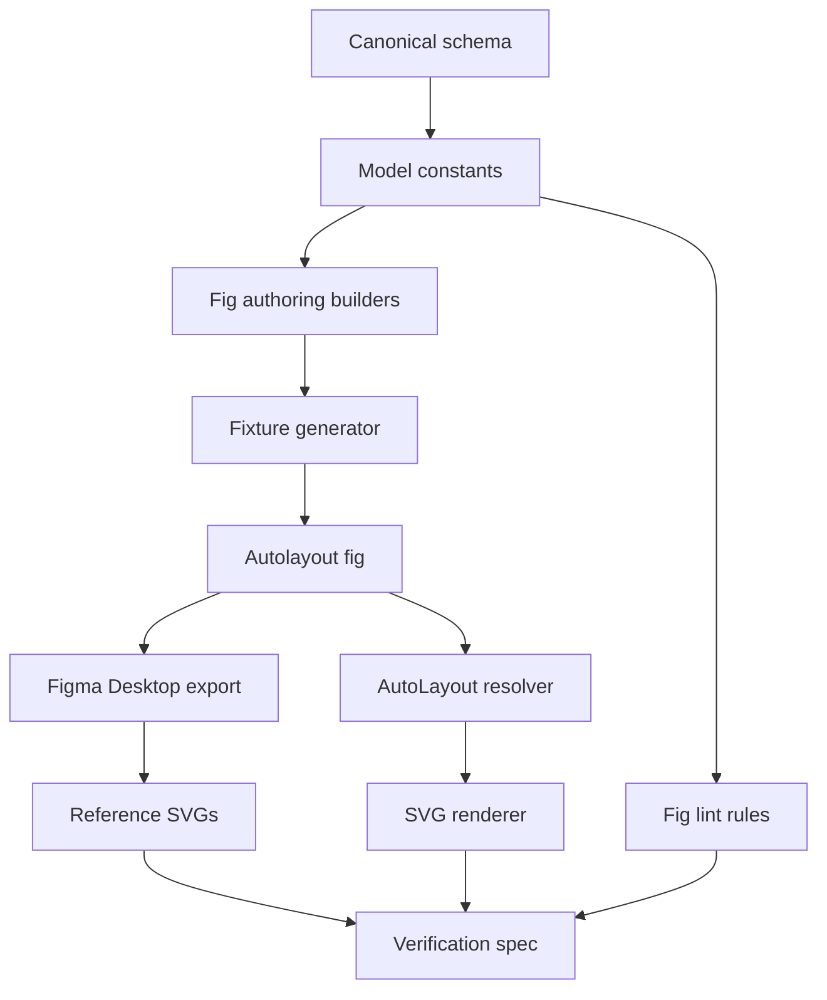
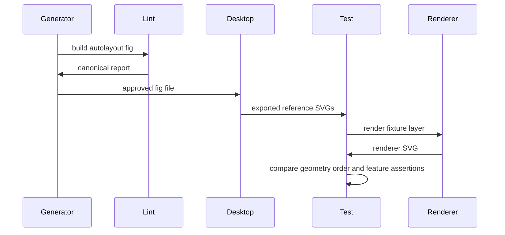

# AutoLayout Expansion Design

## Overview

This feature expands Higma's AutoLayout fixture and renderer coverage so generated `.fig` files use canonical Figma AutoLayout fields and renderer SVG output is compared against Figma Desktop exports.

Fixture authors, renderer maintainers, and reviewers use this work to detect invalid AutoLayout authoring, Figma round-trip drift, and renderer geometry regressions before fixtures are accepted.

The current system changes from partial, skip-tolerant AutoLayout validation to a schema-contract, manifest-driven, fail-fast workflow across fig authoring, fixture generation, renderer layout, and verification.

### Goals
- Serialize AutoLayout fields using canonical Figma Kiwi names and values.
- Expand the AutoLayout fixture set to cover grid, wrap, Hug, Fill growth, clamp, aspect lock, stroke-in-layout, reverse z-order, absolute children, asymmetric padding, nesting, and counter-axis stretch.
- Make SVG verification fail when required Figma references or feature-specific assertions are missing.

### Non-Goals
- Prototype interactions, animations, variant behavior, vector tessellation accuracy, and Symbol or Instance override behavior for AutoLayout fields.
- Replacing Figma Desktop as the source of truth for reference SVG export.
- Broad renderer changes outside the covered AutoLayout fixture frames.

## Boundary Commitments

### This Spec Owns
- Canonical AutoLayout field and enum contracts used by fig authoring and lint validation.
- The `autolayout.fig` fixture manifest, fixture generation script, and required Figma SVG reference map.
- Renderer AutoLayout geometry resolution for the fixture-covered behaviors.
- AutoLayout verification assertions for geometry, render order, aspect ratio, and stroke-in-layout distinctions.

### Out of Boundary
- Manual operation of Figma Desktop export workflows beyond requiring exported SVG files.
- Non-AutoLayout renderer parity for paths, image fills, text shaping, effects, and symbol override semantics.
- Editor UI controls for authoring AutoLayout interactively.
- Replacing existing `.fig` parser, ZIP packaging, or schema decoding infrastructure.

### Allowed Dependencies
- `packages/@higma-document-io/fig/src/fig-file/figma-schema.json` as the canonical Kiwi schema source.
- `@higma-document-models/fig` domain types and constants for shared fig field contracts.
- Existing fig lint infrastructure in `packages/@higma-document-io/fig/src/lint`.
- Existing renderer scene-graph and SVG renderer surfaces in `packages/@higma-document-renderers/fig/src`.
- Existing Bun, TypeScript, Vitest, and ESLint workspace scripts.

### Revalidation Triggers
- Any change to AutoLayout Kiwi field names, enum names, or enum values.
- Any change to the AutoLayout fixture manifest or required reference SVG filenames.
- Any change to renderer child ordering, transform normalization, stroke geometry, or scene-graph layout inputs.
- Any change to `.fig` parse or build paths that can rename, drop, or synthesize AutoLayout fields.

## Architecture

### Existing Architecture Analysis

The fig model package owns domain types and constants. The fig IO package owns `.fig` parsing, building, and linting. The fig renderer package owns scene-graph construction, SVG output, fixtures, and renderer specs.

Current AutoLayout support is split:
- Local constants in `@higma-document-models/fig` diverge from the bundled canonical schema.
- Builders in `@higma-document-io/fig` serialize old field names such as `itemReverseZIndex` and older enum names such as `WRAP`, `FILL`, and `HUG`.
- Renderer layout code handles primary-axis distribution and counter-axis stretch in separate places.
- The AutoLayout verification spec logs and returns for missing layers or reference SVGs.

### Architecture Pattern & Boundary Map



**Architecture Integration**:
- Selected pattern: schema-contract plus resolver. Canonical schema fields drive authoring and lint, while renderer geometry is centralized in one AutoLayout resolver.
- Domain boundaries: model constants describe field contracts, IO serializes and validates files, renderer resolves visible layout geometry, tests verify against Figma exports.
- Existing patterns preserved: colocated unit specs, renderer fixture specs under `spec/`, Bun script execution, and typed lint rule pipeline.
- New components rationale: canonical lint and manifest components are needed because skip behavior and non-canonical aliases currently hide invalid fixtures.
- Steering compliance: strict TypeScript typing, fail-fast validation, no implicit fallback references, and Bun-based test gates.

### Technology Stack

| Layer | Choice / Version | Role in Feature | Notes |
|-------|------------------|-----------------|-------|
| Runtime | Bun 1.3.13 | Runs scripts, lint, typecheck, and tests | Matches root `packageManager` |
| Language | TypeScript 5.9.3 | Contracts, builders, renderer, lint, tests | No `any`; explicit interfaces |
| Test | Vitest 4.1.5 | Unit and fixture verification specs | Existing workspace standard |
| Renderer | Existing SVG renderer | Produces renderer SVG compared to Figma export | No new dependency |
| Source data | Bundled `figma-schema.json` | AutoLayout field SoT | Used by constant and lint tests |

## File Structure Plan

### Directory Structure

```text
packages/
├── @higma-document-models/fig/src/
│   ├── constants/layout.ts
│   ├── constants/layout.spec.ts
│   ├── domain/document.ts
│   ├── domain/conversion/fig-node-conversion.ts
│   └── types.ts
├── @higma-document-io/fig/src/
│   ├── fig-file/frame/frame.ts
│   ├── fig-file/frame/frame.spec.ts
│   ├── fig-file/frame/types.ts
│   ├── fig-file/symbol/symbol.ts
│   ├── fig-file/symbol/symbol.spec.ts
│   ├── fig-file/symbol/types.ts
│   ├── fig-file/shape/base.ts
│   ├── fig-file/text/text.ts
│   ├── fig-file/node/builder-node-types.ts
│   ├── fig-file/node/fig-file-builder.ts
│   ├── lint/rules/autolayout-canonical.ts
│   ├── lint/rules/autolayout-canonical.spec.ts
│   ├── lint/rules/index.ts
│   └── lint/types.ts
└── @higma-document-renderers/fig/
    ├── fixtures/autolayout/autolayout.fig
    ├── fixtures/autolayout/actual/*.svg
    ├── scripts/generate-autolayout-fixtures.ts
    ├── spec/autolayout.spec.ts
    └── src/scene-graph/autolayout-layout.ts
```

### Modified Files
- `packages/@higma-document-models/fig/src/constants/layout.ts` - replace non-canonical AutoLayout enum names with schema-aligned names and expose grid, stack wrap, stack size, reverse z-index, min/max, and grid field contracts.
- `packages/@higma-document-models/fig/src/constants/layout.spec.ts` - compare AutoLayout constants against `figma-schema.json` for `StackMode`, `StackSize`, `StackWrap`, and related fields.
- `packages/@higma-document-models/fig/src/domain/document.ts` - rename domain AutoLayout fields to canonical names and model `stackWrap` as a Kiwi enum value rather than a boolean.
- `packages/@higma-document-models/fig/src/domain/conversion/fig-node-conversion.ts` - extract canonical AutoLayout fields from raw nodes without alias fallback.
- `packages/@higma-document-models/fig/src/types.ts` - add typed raw fields for `stackReverseZIndex`, `StackWrap`, `minSize`, `maxSize`, grid row and column metadata, and aspect lock fields used by fixtures.
- `packages/@higma-document-io/fig/src/fig-file/frame/frame.ts` - update frame builder methods to serialize canonical stack mode, stack wrap, stack size, reverse z-index, min/max, grid, stroke-in-layout, and child grow fields.
- `packages/@higma-document-io/fig/src/fig-file/frame/types.ts` - update `FrameNodeData` with the same canonical AutoLayout field names.
- `packages/@higma-document-io/fig/src/fig-file/symbol/symbol.ts` and `packages/@higma-document-io/fig/src/fig-file/symbol/types.ts` - keep symbol AutoLayout authoring aligned with frame field names where the schema permits them.
- `packages/@higma-document-io/fig/src/fig-file/shape/base.ts` and `packages/@higma-document-io/fig/src/fig-file/text/text.ts` - remove child `FILL` sizing authoring and expose explicit child grow and canonical Hug sizing contracts.
- `packages/@higma-document-io/fig/src/fig-file/node/builder-node-types.ts` - carry canonical AutoLayout fields into `BuilderNode`.
- `packages/@higma-document-io/fig/src/fig-file/node/fig-file-builder.ts` - write canonical node fields and reject non-canonical aliases before encoding.
- `packages/@higma-document-io/fig/src/lint/rules/autolayout-canonical.ts` - new lint rule rejecting `WRAP` stack mode, `FILL` or `HUG` stack-size names, `itemReverseZIndex`, boolean `stackWrap`, and missing canonical fields for fixture-required features.
- `packages/@higma-document-io/fig/src/lint/rules/index.ts` and `packages/@higma-document-io/fig/src/lint/types.ts` - register the AutoLayout canonical rule and rule id.
- `packages/@higma-document-renderers/fig/scripts/generate-autolayout-fixtures.ts` - generate the expanded fixture set from one typed manifest.
- `packages/@higma-document-renderers/fig/spec/autolayout.spec.ts` - consume the manifest, fail on missing layers or SVG references, and add feature-specific geometry/order/aspect assertions.
- `packages/@higma-document-renderers/fig/src/scene-graph/autolayout-layout.ts` - centralize AutoLayout resolved layout for renderer scene-graph construction.
- `packages/@higma-document-renderers/fig/src/scene-graph/builder.ts` - call the AutoLayout resolver and remove duplicated stretch or primary-axis rules from builder-local code.
- `packages/@higma-document-renderers/fig/src/scene-graph/autolayout-primary.ts` - either fold into `autolayout-layout.ts` or keep as an internal helper used only by the new resolver.

### Component Ownership
- AutoLayoutSchemaContract - `packages/@higma-document-models/fig/src/constants/layout.ts`, `packages/@higma-document-models/fig/src/domain/document.ts`, `packages/@higma-document-models/fig/src/types.ts`.
- FigAuthoringBuilders - `packages/@higma-document-io/fig/src/fig-file/frame/frame.ts`, `packages/@higma-document-io/fig/src/fig-file/symbol/symbol.ts`, `packages/@higma-document-io/fig/src/fig-file/shape/base.ts`, `packages/@higma-document-io/fig/src/fig-file/text/text.ts`, `packages/@higma-document-io/fig/src/fig-file/node/fig-file-builder.ts`.
- AutoLayoutCanonicalLintRule - `packages/@higma-document-io/fig/src/lint/rules/autolayout-canonical.ts`, `packages/@higma-document-io/fig/src/lint/rules/index.ts`, `packages/@higma-document-io/fig/src/lint/types.ts`.
- AutoLayoutFixtureManifest - `packages/@higma-document-renderers/fig/scripts/generate-autolayout-fixtures.ts`, `packages/@higma-document-renderers/fig/spec/autolayout.spec.ts`, `packages/@higma-document-renderers/fig/fixtures/autolayout/autolayout.fig`.
- AutoLayoutLayoutResolver - `packages/@higma-document-renderers/fig/src/scene-graph/autolayout-layout.ts`, `packages/@higma-document-renderers/fig/src/scene-graph/builder.ts`, `packages/@higma-document-renderers/fig/src/scene-graph/autolayout-primary.ts`.
- AutoLayoutVerifier - `packages/@higma-document-renderers/fig/spec/autolayout.spec.ts`, `packages/@higma-document-renderers/fig/fixtures/autolayout/actual/*.svg`.

## System Flows



The fixture workflow stops at the first missing canonical field, missing layer, missing reference SVG, or renderer mismatch. No generated renderer snapshot is used as a substitute for a Figma export.

## Requirements Traceability

| Requirement | Summary | Components | Interfaces | Flows |
|-------------|---------|------------|------------|-------|
| 1.1 | Grid uses canonical `GRID` stack mode | AutoLayoutSchemaContract, AutoLayoutFixtureManifest | `StackMode`, `AutoLayoutFixtureCase` | Fixture Generation |
| 1.2 | Wrap uses independent stack wrap | AutoLayoutSchemaContract, FigAuthoringBuilders | `StackWrap`, builder methods | Fixture Generation |
| 1.3 | Hug uses canonical resize-to-fit value | AutoLayoutSchemaContract, FigAuthoringBuilders | `StackSize` | Fixture Generation |
| 1.4 | Fill growth uses child primary grow | FigAuthoringBuilders, AutoLayoutCanonicalLintRule | `AutoLayoutChildLayout` | Fixture Generation |
| 1.5 | Reverse stacking uses canonical reverse field | AutoLayoutSchemaContract, FigAuthoringBuilders | `stackReverseZIndex` | Fixture Generation |
| 1.6 | Non-canonical names fail validation | AutoLayoutCanonicalLintRule | `LintRule` | Fixture Generation |
| 2.1 | Grid fixture exists | AutoLayoutFixtureManifest | `AutoLayoutFixtureCase` | Fixture Generation |
| 2.2 | Wrap fixture exists | AutoLayoutFixtureManifest | `AutoLayoutFixtureCase` | Fixture Generation |
| 2.3 | Hug fixtures exist | AutoLayoutFixtureManifest | `AutoLayoutFixtureCase` | Fixture Generation |
| 2.4 | Fill growth fixture exists | AutoLayoutFixtureManifest | `AutoLayoutFixtureCase` | Fixture Generation |
| 2.5 | Clamp fixtures exist | AutoLayoutFixtureManifest | `AutoLayoutFixtureCase` | Fixture Generation |
| 2.6 | Aspect lock fixture exists | AutoLayoutFixtureManifest | `AutoLayoutFixtureCase` | Fixture Generation |
| 2.7 | Stroke variants exist | AutoLayoutFixtureManifest | `AutoLayoutFixtureCase` | Fixture Generation |
| 2.8 | Reverse, absolute, padding, nested, stretch fixtures exist | AutoLayoutFixtureManifest | `AutoLayoutFixtureCase` | Fixture Generation |
| 3.1 | Round-trip preserves authored settings | AutoLayoutCanonicalLintRule, AutoLayoutReferenceGate | Lint report, manifest | Verification |
| 3.2 | Round-trip drift rejects fixture | AutoLayoutReferenceGate | `AutoLayoutReferenceReport` | Verification |
| 3.3 | Approved frame requires Figma SVG reference | AutoLayoutReferenceGate | Manifest reference path | Verification |
| 3.4 | Missing SVG reference fails | AutoLayoutReferenceGate | Manifest reference path | Verification |
| 4.1 | Grid child intersections match Figma | AutoLayoutLayoutResolver, AutoLayoutVerifier | `ResolvedAutoLayoutFrame` | Render Verification |
| 4.2 | Wrap rows match Figma | AutoLayoutLayoutResolver, AutoLayoutVerifier | `ResolvedAutoLayoutFrame` | Render Verification |
| 4.3 | Hug parent bounds match Figma | AutoLayoutLayoutResolver, AutoLayoutVerifier | `ResolvedAutoLayoutFrame` | Render Verification |
| 4.4 | Fill child size matches Figma | AutoLayoutLayoutResolver, AutoLayoutVerifier | `ResolvedAutoLayoutFrame` | Render Verification |
| 4.5 | Min/max clamp bounds match Figma | AutoLayoutLayoutResolver, AutoLayoutVerifier | `ResolvedAutoLayoutFrame` | Render Verification |
| 4.6 | Stroke-in-layout child positions match Figma | AutoLayoutLayoutResolver, AutoLayoutVerifier | `ResolvedAutoLayoutFrame` | Render Verification |
| 4.7 | Absolute child does not consume flow space | AutoLayoutLayoutResolver, AutoLayoutVerifier | `ResolvedAutoLayoutFrame` | Render Verification |
| 4.8 | Padding, nested, stretch match Figma | AutoLayoutLayoutResolver, AutoLayoutVerifier | `ResolvedAutoLayoutFrame` | Render Verification |
| 5.1 | Reverse rendered order asserted | AutoLayoutVerifier | `FeatureAssertion` | Render Verification |
| 5.2 | Aspect ratio asserted | AutoLayoutVerifier | `FeatureAssertion` | Render Verification |
| 5.3 | Stroke variants distinguished | AutoLayoutVerifier | `FeatureAssertion` | Render Verification |
| 5.4 | Grid and clamp feature assertions exist | AutoLayoutVerifier | `FeatureAssertion` | Render Verification |
| 6.1 | Lint and typecheck pass | Workspace Gates | Bun scripts | Verification |
| 6.2 | Fixture generation produces canonical fields | AutoLayoutFixtureManifest, AutoLayoutCanonicalLintRule | Manifest, lint report | Fixture Generation |
| 6.3 | All fixture layers pass with SVG references | AutoLayoutReferenceGate, AutoLayoutVerifier | Manifest reference map | Render Verification |
| 6.4 | Renderer mismatches fail with layer name | AutoLayoutVerifier | Comparison failure | Render Verification |
| 6.5 | Fixture-and-spec pair exists for every feature | AutoLayoutFixtureManifest, AutoLayoutVerifier | Manifest coverage | Render Verification |

## Components and Interfaces

| Component | Domain / Layer | Intent | Req Coverage | Key Dependencies | Contracts |
|-----------|----------------|--------|--------------|------------------|-----------|
| AutoLayoutSchemaContract | Model | Canonical AutoLayout constants and field types | 1.1, 1.2, 1.3, 1.5 | `figma-schema.json` P0 | State |
| FigAuthoringBuilders | IO | Serialize canonical AutoLayout node fields | 1.1, 1.2, 1.3, 1.4, 1.5 | AutoLayoutSchemaContract P0 | Service |
| AutoLayoutCanonicalLintRule | IO lint | Reject non-canonical or missing AutoLayout fixture fields | 1.6, 3.1, 3.2, 6.2 | LintContext P0 | Service |
| AutoLayoutFixtureManifest | Renderer fixtures | Define required fixture cases and reference paths | 2.1-2.8, 3.3, 6.5 | FigAuthoringBuilders P0 | State, Batch |
| AutoLayoutLayoutResolver | Renderer scene graph | Resolve fixture-covered AutoLayout geometry and order | 4.1-4.8 | FigDesignNode P0 | Service |
| AutoLayoutVerifier | Renderer spec | Compare renderer SVG against Figma export and feature assertions | 3.4, 5.1-5.4, 6.3, 6.4 | AutoLayoutFixtureManifest P0, SVG renderer P0 | Service |

### Model and IO

#### AutoLayoutSchemaContract

| Field | Detail |
|-------|--------|
| Intent | Make Figma's canonical AutoLayout schema names the project-wide authoring contract |
| Requirements | 1.1, 1.2, 1.3, 1.5, 6.2 |

**Responsibilities & Constraints**
- Owns canonical `StackMode`, `StackSize`, `StackWrap`, `StackPositioning`, and AutoLayout field names.
- Does not translate old aliases into canonical names.
- Constants must be mechanically checked against bundled schema definitions.

**Dependencies**
- Outbound: `figma-schema.json` - schema definition comparison (P0).
- Inbound: fig builders, model conversion, renderer fixture generation (P0).

**Contracts**: Service [ ] / API [ ] / Event [ ] / Batch [ ] / State [x]

##### State Management
- State model: readonly TypeScript constants and string-literal union types.
- Persistence & consistency: source code constants must match `figma-schema.json`.
- Concurrency strategy: no runtime mutation.

#### FigAuthoringBuilders

| Field | Detail |
|-------|--------|
| Intent | Build frame, symbol, shape, text, and raw node data with canonical AutoLayout fields |
| Requirements | 1.1, 1.2, 1.3, 1.4, 1.5, 2.1-2.8 |

**Responsibilities & Constraints**
- `autoLayout("GRID")` serializes `stackMode: { name: "GRID", value: 3 }`.
- Wrapping serializes `stackWrap: { name: "WRAP", value: 1 }` without changing `stackMode` to `WRAP`.
- Hug serializes `StackSize.RESIZE_TO_FIT_WITH_IMPLICIT_SIZE`.
- Fill growth serializes `stackChildPrimaryGrow` on the child.
- Reverse stacking serializes `stackReverseZIndex`.
- Missing required AutoLayout arguments throw before `build()`.

**Dependencies**
- Inbound: fixture generator and existing callers (P0).
- Outbound: AutoLayoutSchemaContract (P0).
- Outbound: `FigFileBuilder` encoder (P0).

**Contracts**: Service [x] / API [ ] / Event [ ] / Batch [ ] / State [ ]

##### Service Interface

```typescript
type CanonicalStackMode = "NONE" | "HORIZONTAL" | "VERTICAL" | "GRID";
type CanonicalStackSize = "FIXED" | "RESIZE_TO_FIT" | "RESIZE_TO_FIT_WITH_IMPLICIT_SIZE";
type CanonicalStackWrap = "NO_WRAP" | "WRAP";

interface AutoLayoutAuthoringBuilder {
  autoLayout(mode: CanonicalStackMode): AutoLayoutAuthoringBuilder;
  wrap(mode: CanonicalStackWrap): AutoLayoutAuthoringBuilder;
  primarySizing(size: CanonicalStackSize): AutoLayoutAuthoringBuilder;
  counterSizing(size: CanonicalStackSize): AutoLayoutAuthoringBuilder;
  primaryGrow(value: number): AutoLayoutAuthoringBuilder;
  reverseZIndex(enabled: boolean): AutoLayoutAuthoringBuilder;
}
```

- Preconditions: every method receives an explicit canonical value; boolean overloads are not accepted for wrap.
- Postconditions: `build()` returns node data with only canonical AutoLayout fields.
- Invariants: `FILL`, `HUG`, `WRAP` as stack mode, and `itemReverseZIndex` are never emitted.

#### AutoLayoutCanonicalLintRule

| Field | Detail |
|-------|--------|
| Intent | Fail generated fixtures that contain non-canonical or incomplete AutoLayout encoding |
| Requirements | 1.6, 3.1, 3.2, 6.2 |

**Responsibilities & Constraints**
- Reports an error for `stackMode.name === "WRAP"`.
- Reports an error for `stackPrimarySizing.name` or `stackCounterSizing.name` equal to `FILL` or `HUG`.
- Reports an error when raw node data contains `itemReverseZIndex`.
- Reports an error when wrap is encoded as a boolean rather than a `StackWrap` enum.
- Reports an error when fixture-required AutoLayout fields are missing.

**Dependencies**
- Inbound: fig lint CLI, fixture generation test, package test suite (P0).
- Outbound: lint context and `LintFinding` types (P0).

**Contracts**: Service [x] / API [ ] / Event [ ] / Batch [ ] / State [ ]

##### Service Interface

```typescript
interface LintRule {
  (context: LintContext, emit: (finding: LintFinding) => void): void;
}
```

- Preconditions: `LintContext.nodeChanges` contains normalized raw fig nodes.
- Postconditions: every non-canonical AutoLayout finding includes the node path and canonical remediation.
- Invariants: the rule never mutates lint context and never catches validation errors to continue silently.

### Renderer Fixtures and Verification

#### AutoLayoutFixtureManifest

| Field | Detail |
|-------|--------|
| Intent | Define the required AutoLayout fixture cases, generation data, and reference SVG path |
| Requirements | 2.1-2.8, 3.3, 6.5 |

**Responsibilities & Constraints**
- Owns exactly the required fixture layer names:
  `auto-grid-2x3`, `auto-wrap-3-rows`, `auto-hug-h`, `auto-hug-v`, `auto-fill-grow`, `auto-min-clamp`, `auto-max-clamp`, `auto-aspect-lock`, `auto-strokes-on`, `auto-strokes-off`, `auto-z-reverse`, `auto-absolute-mix`, `auto-padding-asym`, `auto-nested`, and `auto-stretch-counter`.
- Each case declares the AutoLayout feature, layer name, reference SVG filename, and required assertions.
- The generator and verifier consume the same manifest.

**Dependencies**
- Inbound: fixture generator and verification spec (P0).
- Outbound: FigAuthoringBuilders (P0).

**Contracts**: Service [ ] / API [ ] / Event [ ] / Batch [x] / State [x]

##### Batch / Job Contract
- Trigger: `bun run packages/@higma-document-renderers/fig/scripts/generate-autolayout-fixtures.ts`.
- Input / validation: typed manifest with unique layer names and reference filenames.
- Output / destination: `fixtures/autolayout/autolayout.fig`.
- Idempotency & recovery: repeated generation produces the same frame names and fails if lint reports AutoLayout canonical errors.

#### AutoLayoutLayoutResolver

| Field | Detail |
|-------|--------|
| Intent | Resolve renderer geometry for fixture-covered AutoLayout behavior |
| Requirements | 4.1, 4.2, 4.3, 4.4, 4.5, 4.6, 4.7, 4.8 |

**Responsibilities & Constraints**
- Computes flow child positions for horizontal, vertical, wrap, and grid containers.
- Computes Hug parent bounds from resolved child bounds, padding, spacing, stroke-in-layout, min/max clamps, and aspect lock.
- Applies child grow through `stackChildPrimaryGrow`.
- Excludes absolute children from flow space while preserving their authored transform.
- Applies reverse stacking order for render output.
- Owns renderer geometry only; it does not serialize `.fig` fields.

**Dependencies**
- Inbound: scene-graph builder (P0).
- Outbound: FigDesignNode and child layout constraints (P0).
- Outbound: stroke geometry inputs already available to scene graph (P1).

**Contracts**: Service [x] / API [ ] / Event [ ] / Batch [ ] / State [ ]

##### Service Interface

```typescript
type AutoLayoutFeature =
  | "grid"
  | "wrap"
  | "hug"
  | "fill-grow"
  | "clamp"
  | "aspect-lock"
  | "stroke-in-layout"
  | "reverse-z"
  | "absolute"
  | "padding"
  | "nested"
  | "counter-stretch";

type ResolvedAutoLayoutChild = {
  readonly id: string;
  readonly x: number;
  readonly y: number;
  readonly width: number;
  readonly height: number;
  readonly renderIndex: number;
};

type ResolvedAutoLayoutFrame = {
  readonly id: string;
  readonly width: number;
  readonly height: number;
  readonly children: readonly ResolvedAutoLayoutChild[];
};

interface AutoLayoutLayoutResolver {
  resolveFrame(frame: FigDesignNode, children: readonly FigDesignNode[]): ResolvedAutoLayoutFrame;
}
```

- Preconditions: caller passes the parent frame and direct children after symbol and raw fig conversion.
- Postconditions: returned child rectangles are in parent-local coordinates and render indices reflect reverse z-order when enabled.
- Invariants: missing required layout fields throw a typed error; no guessed spacing, padding, or size defaults are introduced for fixture-required cases.

#### AutoLayoutVerifier

| Field | Detail |
|-------|--------|
| Intent | Compare rendered AutoLayout SVG against Figma reference SVGs and feature-specific assertions |
| Requirements | 3.4, 5.1, 5.2, 5.3, 5.4, 6.3, 6.4, 6.5 |

**Responsibilities & Constraints**
- Fails when a manifest layer is absent from `autolayout.fig`.
- Fails when a manifest reference SVG is absent from `fixtures/autolayout/actual`.
- Extracts geometry and render order from Figma SVG and renderer SVG.
- Runs feature-specific assertions for reverse order, aspect ratio, stroke-in-layout differences, grid intersections, and min/max clamp sizes.
- Identifies the layer name in every failure message.

**Dependencies**
- Inbound: Vitest fixture spec (P0).
- Outbound: AutoLayoutFixtureManifest, SVG renderer, `.fig` parser (P0).

**Contracts**: Service [x] / API [ ] / Event [ ] / Batch [ ] / State [ ]

##### Service Interface

```typescript
type FeatureAssertionResult =
  | { readonly ok: true }
  | { readonly ok: false; readonly layerName: string; readonly message: string };

interface AutoLayoutVerificationService {
  verifyLayer(layerName: string): Promise<FeatureAssertionResult>;
}
```

- Preconditions: manifest entry exists and reference SVG exists.
- Postconditions: renderer mismatch returns or throws a failure with layer name and assertion detail.
- Invariants: verification never substitutes a renderer snapshot for a Figma reference.

## Data Models

### Domain Model
- `AutoLayoutSchemaContract` is the aggregate for field-name and enum-name validity.
- `AutoLayoutFixtureCase` is the aggregate for fixture coverage, reference path, and feature assertions.
- `ResolvedAutoLayoutFrame` is the value object consumed by scene graph rendering.

### Logical Data Model

```typescript
type AutoLayoutFixtureCase = {
  readonly layerName: string;
  readonly feature: AutoLayoutFeature;
  readonly referenceSvg: string;
  readonly assertions: readonly AutoLayoutAssertion[];
};

type AutoLayoutAssertion =
  | { readonly type: "geometry" }
  | { readonly type: "render-order" }
  | { readonly type: "aspect-ratio"; readonly width: number; readonly height: number }
  | { readonly type: "stroke-layout-delta"; readonly compareWithLayerName: string }
  | { readonly type: "grid-intersections"; readonly columns: number; readonly rows: number }
  | { readonly type: "clamp"; readonly axis: "width" | "height"; readonly size: number };
```

**Consistency & Integrity**
- `layerName` values are unique.
- `referenceSvg` values must exist before verification passes.
- Every required feature in 6.5 appears in at least one manifest case.
- Assertions are explicit; the verifier does not infer feature intent from layer names.

### Data Contracts & Integration
- `.fig` node data uses canonical Kiwi field names from `figma-schema.json`.
- Reference SVG files are treated as external source-of-truth artifacts produced by Figma Desktop.
- Renderer SVG is transient test output and must not be accepted as a reference artifact.

## Error Handling

### Error Strategy
- Builder methods throw when a required AutoLayout value is missing or non-canonical.
- Lint reports non-canonical serialized fields as error-severity findings.
- Fixture generation fails if lint returns any AutoLayout canonical errors.
- Verification fails on missing layers, missing reference SVGs, geometry mismatch, order mismatch, aspect mismatch, and missing feature coverage.

### Error Categories and Responses
- Authoring contract errors: point to canonical field name and node path.
- Fixture manifest errors: identify duplicate or missing layer name.
- Reference export errors: identify missing SVG path.
- Renderer parity errors: identify layer name, assertion type, expected value, and rendered value.

### Monitoring
No runtime monitoring is introduced. Observability is through structured lint output, Vitest assertion messages, and generated SVG snapshots written only as diagnostics.

## Testing Strategy

### Unit Tests
- `constants/layout.spec.ts` verifies canonical AutoLayout enum names and values against `figma-schema.json` for `StackMode`, `StackSize`, `StackWrap`, and reverse field names.
- `fig-file/frame/frame.spec.ts`, `symbol.spec.ts`, `shape` specs, and `text` specs verify builders serialize `GRID`, `StackWrap`, `RESIZE_TO_FIT_WITH_IMPLICIT_SIZE`, `stackChildPrimaryGrow`, and `stackReverseZIndex`.
- `lint/rules/autolayout-canonical.spec.ts` verifies `WRAP` stack mode, `FILL`, `HUG`, `itemReverseZIndex`, and boolean `stackWrap` produce error findings.
- `src/scene-graph/autolayout-layout.spec.ts` verifies grid intersections, wrapping rows, Hug sizing, Fill growth, min/max clamp, stroke-in-layout, absolute child exclusion, asymmetric padding, nested layout, and counter-axis stretch.

### Integration Tests
- `spec/autolayout.spec.ts` verifies every manifest layer exists in `autolayout.fig`.
- `spec/autolayout.spec.ts` verifies every manifest reference SVG exists under `fixtures/autolayout/actual`.
- `spec/autolayout.spec.ts` compares rendered SVG geometry against Figma SVG geometry for every fixture case.
- `spec/autolayout.spec.ts` runs feature-specific assertions for reverse order, aspect ratio, stroke variants, grid, and min/max fixtures.

### End-to-End Gates
- `bun run --filter @higma-document-io/fig lint`
- `bun run --filter @higma-document-io/fig typecheck`
- `bun run --filter @higma-document-io/fig test`
- `bun run --filter @higma-document-renderers/fig lint`
- `bun run --filter @higma-document-renderers/fig typecheck`
- `bun run --filter @higma-document-renderers/fig test`

## Performance & Scalability
- Fixture verification operates on a small fixed manifest and is not a runtime hot path.
- The renderer resolver must run once per AutoLayout frame during scene-graph construction and must avoid repeated tree-wide scans for each child.
- SVG parsing in tests may remain fixture-local; no shared cache is required unless the test file begins re-reading the same SVG per assertion.
